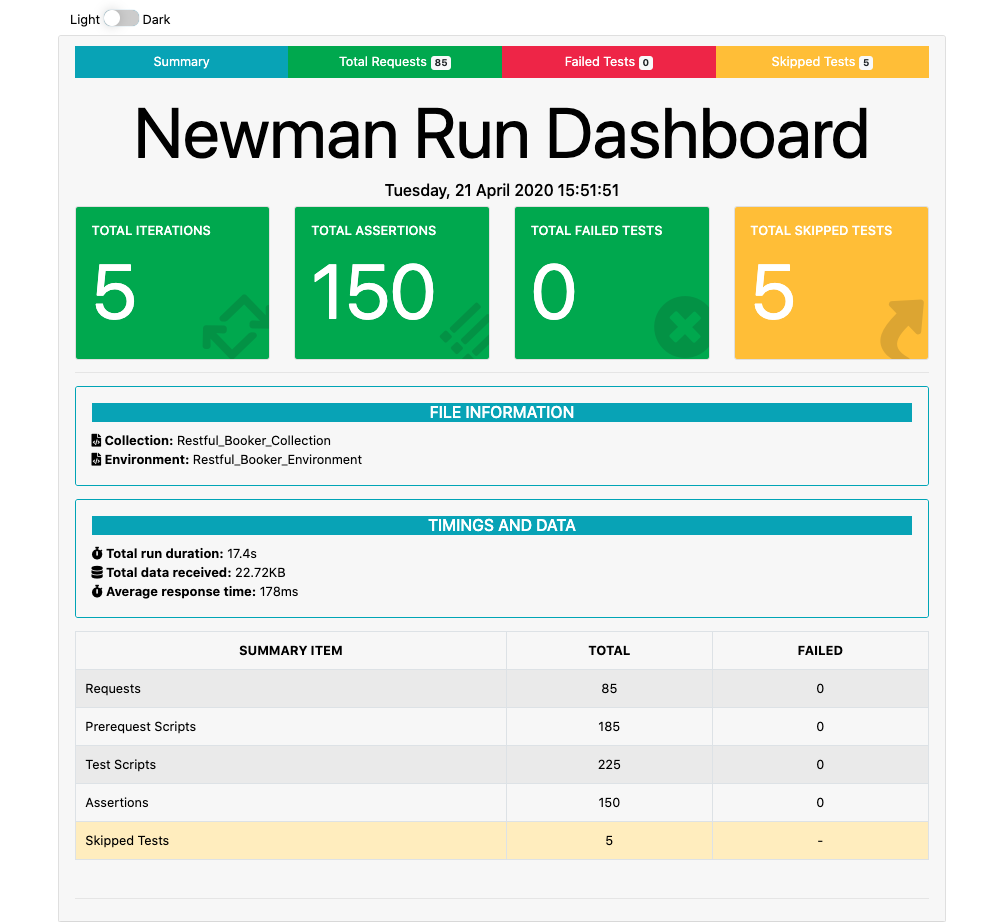
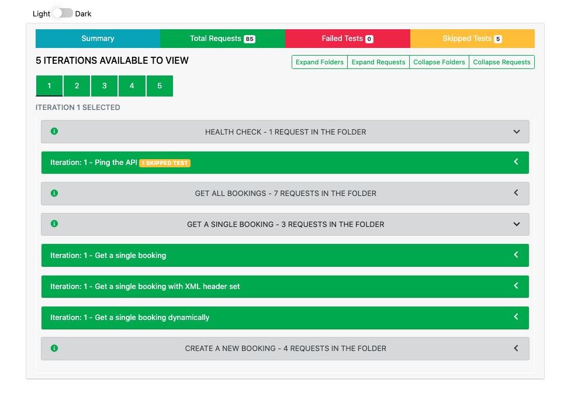
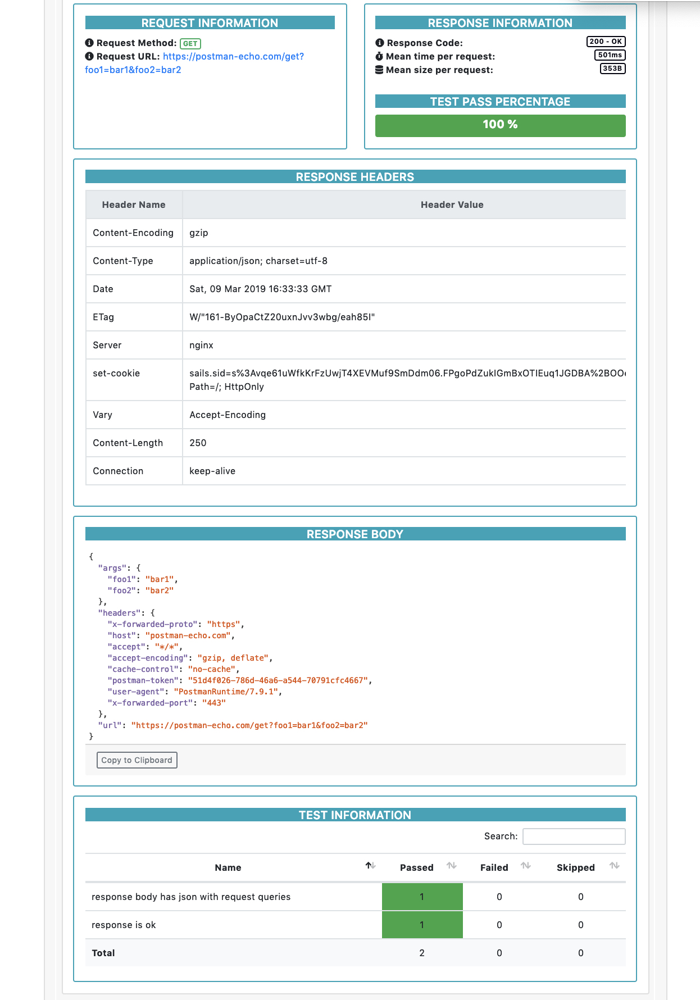
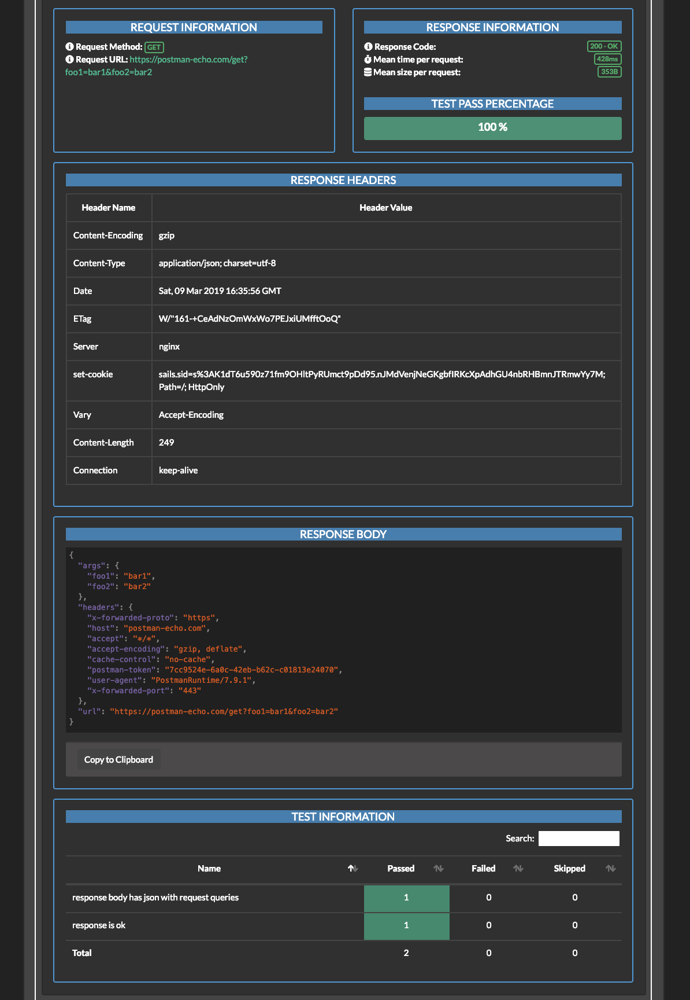
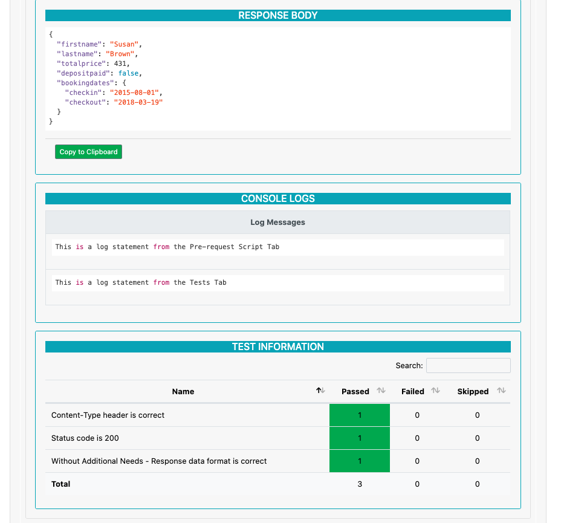

# newman-reporter-htmlextra

[](https://travis-ci.org/DannyDainton/newman-reporter-htmlextra)
[](https://www.npmjs.com/package/newman-reporter-htmlextra)
[](https://www.npmjs.com/package/newman-reporter-htmlextra)
[](https://www.npmjs.com/package/newman-reporter-htmlextra) [](https://greenkeeper.io/)

A [Newman](https://github.com/postmanlabs/newman) HTML reporter that has been extended to include the separation of the iteration runs so these are no longer aggregated together and also some additional `handlebars helpers` to enable users to create better custom templates. This reporter comes with a default dashboard style template and also a `Dark Theme` version that can be switched using a CLI flag.

---

## Some of the Extras

- Full separated iterations runs and not aggregated stats - Default template shows iteration number in heading
- Includes the full [handlebars-helpers](https://www.npmjs.com/package/handlebars-helpers) module for building better templates
- New `percent` helper to help exposing data like `Test Pass Percentage` - e.g `{{percent cumulativeTests.passed cumulativeTests.failed}}`
- Copy and Paste any of the Response Bodies
- Includes an `inc` helper to work with things like the handlebars zero index - e.g `Iteration:{{inc cursor.iteration}} - {{item.name}}`
- Added the [helper-moment](https://github.com/helpers/helper-moment) module so you have more control over the display dates - e.g `{{moment date format="dddd, DD MMMM YYYY HH:mm:ss"}}`
- Exposed the `Skipped Tests` so you can tell which ones are skipped, in the main summary view. You can also see which tests are skipped within the single request view
- Folder level descriptions with rendered Markdown syntax
- Response Headers displayed for each of the requests
- Iterations separated by tabs in the `Requests` view
- First attempt to add the `console.log` statements, using the `--reporter-htmlextra-logs` CLI flag - These are currently separate from the parent requests but it's the first step in getting them on the report
- A `Dark Theme` dashboard template - This is an option from the CLI using the `--reporter-htmlextra-darkTheme` flag or in a script by setting the `darkTheme` property to `true`.
- A `helper` to give more control over the main `title` shown on the report. Use the `--reporter-htmlextra-title` flag to add your own unique headline.
- The default filename, if you do not supply the `export` location, is now includes the collection name in the filename rather that the reporter name.
- Use the `onlyShowFails` option to reduce the report down to just showing the requests that had test failures.
- More to come...

## Interactive Report Examples

To give you an idea of what the final reports will look like, I've added a few working examples here:

- [All the Tests Passing](https://s3.eu-west-2.amazonaws.com/newman-htmlextra-reports/All_Passed.html)
- [Failed and Skipped Tests during the Collection run](https://s3.eu-west-2.amazonaws.com/newman-htmlextra-reports/Fails_And_Skips.html)
- [The Dark Theme version of the final report](https://s3.eu-west-2.amazonaws.com/newman-htmlextra-reports/Dark_Theme.html)

These a _just_ a few of the reports that can be produced from the reporter. You will find more options available to help configure the final output, in the sections below.

## Install

> The installation should be global if newman is installed globally, local otherwise.

For `global` install:

```console
npm install -g newman-reporter-htmlextra
```

For `local` install:

```console
npm install -S newman-reporter-htmlextra
```

## Usage

In order to enable this reporter, specify `htmlextra` in Newman's `-r` or `--reporters` option.

```console
newman run https://www.getpostman.com/collections/631643-f695cab7-6878-eb55-7943-ad88e1ccfd65-JsLv -r htmlextra
```

### Options

#### With Newman CLI

| CLI Option  | Description       |
|-------------|-------------------|
| `--reporter-htmlextra-export <path>` | Specify a path where the output HTML file will be written to disk. If not specified, the file will be written to `newman/` in the current working directory. |
| `--reporter-htmlextra-template <path>` | Specify a path to the custom template which will be used to render the HTML report. This option depends on `--reporter htmlextra` and `--reporter-htmlextra-export` being present in the run command. If this option is not specified, the [default template](./lib/dashboard-template.hbs) is used |
| `--reporter-htmlextra-showOnlyFails` | Use this optional flag to tell the reporter to display only the requests with failed tests. |
| `--reporter-htmlextra-darkTheme` | Use this optional flag to switch the reporter template to the `Dark Theme` dashboard. |
| `--reporter-htmlextra-testPaging` | Use this optional flag to add pagination to the tests in the request view. |
| `--reporter-htmlextra-title` | This optional flag can be used to give your report a different main `Title` in the centre of the report. If this is not set, the report will show "Newman Run Dashboard". |
| `--reporter-htmlextra-logs` | This optional flag shows any console log statements in the collection, on the final report. The is `false` by default. |

Custom templates (currently handlebars only) can be passed to the HTML reporter via `--reporter-htmlextra-template <path>` with `--reporters htmlextra` and `--reporter-htmlextra-export`.
The [default template](./lib/dashboard-template.hbs) is used in all other cases.

To create a report that only shows the requests with `Failed` tests, from the CLI, the following command can be used:

```console
newman run https://www.getpostman.com/collections/631643-f695cab7-6878-eb55-7943-ad88e1ccfd65-JsLv -r htmlextra --reporter-htmlextra-showOnlyFails
```

To create the `Dark Theme` report from the CLI, the following command can be used:

```console
newman run https://www.getpostman.com/collections/631643-f695cab7-6878-eb55-7943-ad88e1ccfd65-JsLv -r htmlextra --reporter-htmlextra-darkTheme
```

To add a custom `Title` to your report from the CLI, the following command can be used:

```console
newman run https://www.getpostman.com/collections/631643-f695cab7-6878-eb55-7943-ad88e1ccfd65-JsLv -r htmlextra --reporter-htmlextra-title "My new report title"
```

To show the `console.log()` statements on the report from the CLI, the following command can be used:

```console
newman run https://www.getpostman.com/collections/631643-f695cab7-6878-eb55-7943-ad88e1ccfd65-JsLv -r htmlextra --reporter-htmlextra-logs
```

#### With Newman as a Library

All the CLI functionality is available for programmatic use as well within a `nodejs` script.

```javascript
const newman = require('newman');

newman.run({
    collection: require('./examples/Restful_Booker_Collection.json'), // can also provide a URL or path to a local JSON file.
    environment: require('./examples/Restful_Booker_Environment.json'),
    reporters: 'htmlextra',
    reporter: {
        htmlextra: {
            export: './<html file path>', // If not specified, the file will be written to `newman/` in the current working directory.
            template: '<template path>' // optional, the default template will be used if one is not specified
        }
    }
}, function (err) {
    if (err) { throw err; }
    console.log('collection run complete!');
});
```

Add the `showOnlyFails` property to the `htmlextra` object, to create a report showing only requests with test failures.

```javascript
const newman = require('newman');

newman.run({
    collection: require('./examples/Restful_Booker_Collection.json'), // can also provide a URL or path to a local JSON file.
    environment: require('./examples/Restful_Booker_Environment.json'),
    reporters: 'htmlextra',
    reporter: {
        htmlextra: {
            export: './<html file path>', // If not specified, the file will be written to `newman/` in the current working directory.
            showOnlyFails: true // optional, tells the reporter to create a report showing only the requests with failed tests.
    }
}, function (err) {
    if (err) { throw err; }
    console.log('collection run complete!');
});
```

To use the `dark theme` template within a script - Add the `darkTheme` property to the `htmlextra` object. If the `template` option is also part of the object, this will overwrite the `darkTheme` option.

```javascript
const newman = require('newman');

newman.run({
    collection: require('./examples/Restful_Booker_Collection.json'), // can also provide a URL or path to a local JSON file.
    environment: require('./examples/Restful_Booker_Environment.json'),
    reporters: 'htmlextra',
    reporter: {
        htmlextra: {
            export: './<html file path>', // If not specified, the file will be written to `newman/` in the current working directory.
            darkTheme: true // optional, tells the reporter to use the `Dark Theme` template
        }
    }
}, function (err) {
    if (err) { throw err; }
    console.log('collection run complete!');
});
```

Add the `title` property to the `htmlextra` object, to pass in your own custom title to the report.

```javascript
const newman = require('newman');

newman.run({
    collection: require('./examples/Restful_Booker_Collection.json'), // can also provide a URL or path to a local JSON file.
    environment: require('./examples/Restful_Booker_Environment.json'),
    reporters: 'htmlextra',
    reporter: {
        htmlextra: {
            export: './<html file path>', // If not specified, the file will be written to `newman/` in the current working directory.
            title: 'My new report title' // optional, tells the reporter to use this as the main title in the centre of the report
        }
    }
}, function (err) {
    if (err) { throw err; }
    console.log('collection run complete!');
});
```

Add the `logs` property to the `htmlextra` object, to pass in your own custom title to the report.

```javascript
const newman = require('newman');

newman.run({
    collection: require('./examples/Restful_Booker_Collection.json'), // can also provide a URL or path to a local JSON file.
    environment: require('./examples/Restful_Booker_Environment.json'),
    reporters: 'htmlextra',
    reporter: {
        htmlextra: {
            export: './<html file path>', // If not specified, the file will be written to `newman/` in the current working directory.
            logs: true // optional, tells the reporter to display the console log statements in the report. This is False by default.
        }
    }
}, function (err) {
    if (err) { throw err; }
    console.log('collection run complete!');
});
```

## Default Dashboard








## Dark Theme Dashboard




### Show Only Failures

If you have multiple requests in your collections the report can become quite verbose, I've added a flag option to just create the report with only the requests that have `Failed` tests. This is very similar to the default report but the folders will already be expanded, if their are any failed tests.


Add the `darkTheme` flag to see this in the `dark` view.


### Console Logs

This is the first attempt to expose any `console.log` statements that are really useful to have in your `Requests`. The event from Newman doesn't contain a lot of detail about the request that it was part of and this will involve, in it's current state a horrible hacky fix to map things together. In the meantime, the Postman `pm.info` function provides these for you and can just be added to the `console.log` statement, as workaround. Something like `${pm.info.requestName} | ${pm.info.eventName} | Iteration: ${pm.info.iteration + 1}` will log out the missing event information.

If the collection contains Console Logs and you use the `--reporter-htmlextra-logs` flag, a new tab will appear, that will show all the details. This information is displayed in a similar way that you may have seen on the `Failed Tests` and `Skipped Tests`.



## Compatibility

| **newman-reporter-htmlextra** | **newman** | **node** |
|:------------------------:|:----------:|:--------:|
|         >= v1.1.0          | >= v4.2.3  | >= v8.x  |

## Community Support


If you are interested in talking to the Postman team and fellow Newman users, you can find us on our [Postman Community Forum](https://community.getpostman.com). Feel free to drop by and say hello. You'll find us posting about upcoming features and beta releases, answering technical support questions, and contemplating world peace.

Sign in using your Postman account to participate in the discussions and don't forget to take advantage of the [search bar](https://community.getpostman.com/search?q=newman) - the answer to your question might already be waiting for you! Don’t want to log in? Then lurk on the side-lines and absorb all the knowledge.

## License

This software is licensed under Apache-2.0. Copyright Postdot Technologies, Inc. See the [LICENSE.md](LICENSE.md) file for more information.

## Special mention

This work have been hugely inspired and copied several aspects of the great work done by [Martijn Vander Vlag](https://github.com/martijnvandervlag) to create the [newman-reporter-htmlfull](https://github.com/martijnvandervlag/newman-reporter-htmlfull) package. Check out that package too, this contains many of the same features.

It was also brought together by reviewing some of the feature requests, for the official Postman HTML reporter.
